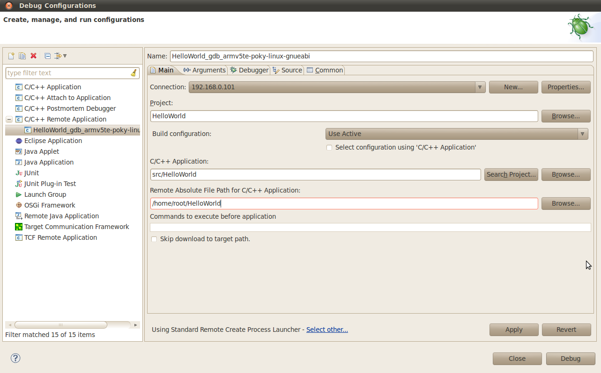

How to write a software application for the Pengwyn board
=========================================================

Hereafter, the operating system that runs the IDE/debugger will be named host machine, and the board being debugged will be named target machine.
The host machine could be running as a virtual machine guest operating system, anyway, the documentation for the host machine running as a guest operating system and as host operating system is exactly the same.

Pay attention before to start writing your application you need:

* a filesystem (you can use bitbake/hob to build your preferred filesystem) with develop support (that is, it must include all the necessary header files, the tcf-agent program and gdbserver)

* an SD card already partitioned, with the bootloader in the FAT partition, and

* a network connect between the host machine and the target machine.

.. index:: Project

Creating the Project
--------------------

You can create two types of projects: Autotools-based, or Makefile-based. This section describes how to create Autotools-based projects from within the **Eclipse IDE**.
Launch Eclipse using Architech Launcher or use **run_eclipse** command or just click on the desktop icon.

To create a project based on a Yocto template and then display the source code, follow these steps:

* Select File→New→Project...
* Under *C/C++*, double click on *C Project* to create the project.
* Expand *Yocto ADT Project*.
* Select *Hello World ANSI C Autotools Project*. This is an Autotools-based project based on a Yocto Project template.

.. image:: _static/newproject.png

* Put a name in the Project *name:* field. Do not use hyphens as part of the name.
* Click *Next*.
* Add information in the *Author* and *Copyright* notice fields.
* Be sure the *License* field is correct.
* Click *Finish*.

**Note:** If the "open perspective" prompt appears, click *Yes* so that you enter in the C/C++ perspective.
The left-hand navigation pane shows your project. You can display your source by double clicking the project's source file.

Building the Project
--------------------

To build the project, select Project→Build Project. The console should update with messages from the cross-compiler.
To add more libraries to compile:

* Click on Project→Properties.
* Expand the box next to Autotools.
* Select Configure Settings.
* In CFLAGS field, you can add the path of includes with -Ipath_include
* In LDFLAGS field, you can specify the libraries you use with -lname_library and you can also specify the path where to look for libraries with -Lpath_library

**Note:** All libraries are located in *~/yocto/remote/nfs-eclipse-rootfs* subdirectories.

.. index:: Debug

Deploying and Debugging the Application
---------------------------------------

Connect the Pengwyn board to the PC by means of a usb cable to power the board and to have the serial console

.. image:: _static/pengwyn-power.jpg

Once you built the project and the board is running the image, use minicom (refer to section :ref:`usbSerial` to know how to configure minicom) to run **tcf-agent** program in target board:

::

 Yocto (Built by Poky 7.0.1) 1.2.1                                               
  ttyO0                                                                          
                                                                                
 pengwyn login: root                                                             
 root@pengwyn:~# /etc/init.d/tcf-agent restart

On the Host machine, follow these steps to let **Eclipse** deploy and debug your application:

* Select *Remote System Explorer* perspective.

* In *Remote System* area right-click TCF icon and select *Property*.

* In *Host* tab, insert in *Host Name* and *Connection Name* fields the IP address of the target board. (e.g. 192.168.0.101)

* Then press *OK*.
* Select Run→Debug Configurations...
* In the left area, expand *C/C++Remote Application*.
* Locate your project and select it to bring up a new tabbed view in the *Debug Configurations* Dialog.

* Use the drop-down menu now in the *Connection* field and pick the IP Address you entered earlier.
* Enter the absolute path on the target into which you want to deploy the application. Use the *Browse* button near *Remote Absolute File Path for C/C++Application:* field. No password is needed.

.. image:: _static/remotepath.png

* Enter also in the path the name of the application you want to build. (e.g. HelloWorld)

* Click *Debug* to bring up a login screen and login.
* Accept the debug perspective. 

.. important::

	If debug does not works, check if tcf-agent is running on the board and gdbserver is present.
