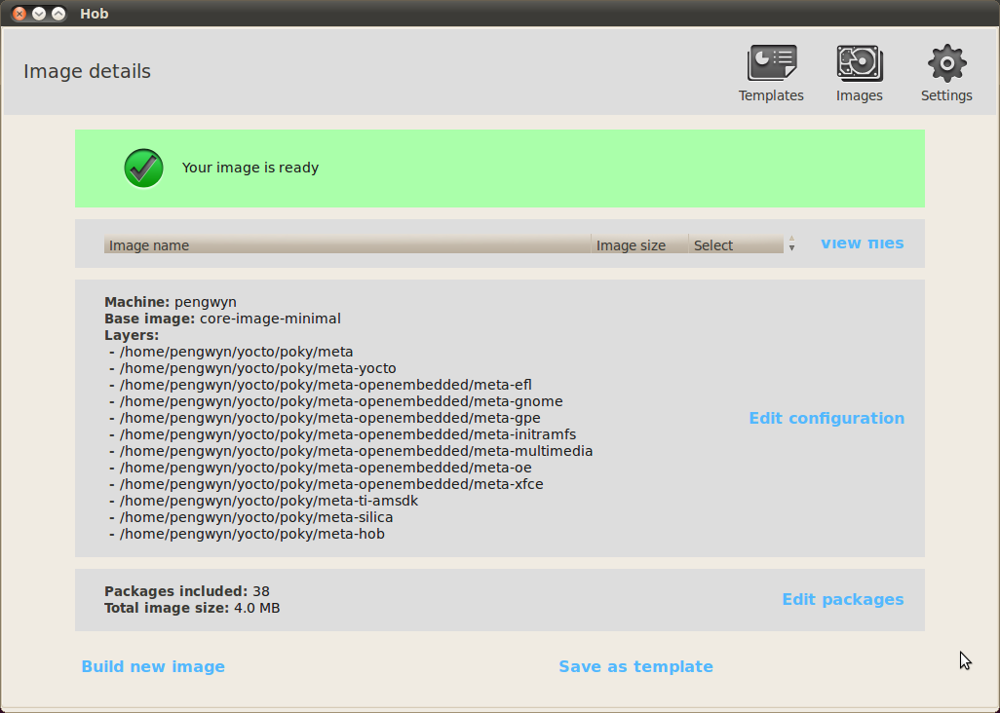

.. _howToUseHOB:

How to use HOB
==============

HOB is a graphical interface for bitbake. To run it, :ref:`prepare the environment <prepareEnvironment>` than run **run_hob** command or click icon from desktop,

HOB window will appear.

.. _hobSpeedup:

How to speedup the build process
--------------------------------

When you imported the virtual machine you might have changed the number of processors made available to the virtual machine itself. If you did that, you can optimize the build time in this way:

* Click on **Settings**, a new window will appear. Select on **Build environment** tab.

.. image:: _static/hob-parallelism.png

* Change **BB number threads** value from 2 to *<number of processors used by the virtual machine> * 2*, set **Parallel make** to the same value. Click on save.

This modification will be available just for the current build directory, to make it permanent please refer to Poky's guide on :ref:`pokySpeedup`.

How to change the root file system package format
-------------------------------------------------

It is possible to choose between the following formats:

* ipk,
* rpm, and
* deb,

by clicking on **Settings** →  **Output**

choosing your preferred package format, and saving.

How to build a predefined image
-------------------------------

Select **pengwyn** from the combo-box, after the recipes have been parsed the section **Select a base image** will appear and you can choose your preferred image. 

Click on **Build image**

than the build process will start.

Please note that the build process can last several hours till it finishes.

It might happen that a fetch task gives an error, if so, double check that the virtual machine has a proper network configuration. If the network configuration has been proved correct, the error might mean that the needed server is down for some reason, in that case the only option you have is to wait and try again later.

How to build a custom image
---------------------------

There are two possible ways to customize an image to build:

* modify a predefined image,
* create a new image from scratch.

Once you selected a predefined image, you can click on **View recipes** to add/remove recipes and tasks or you can click on **View packages** to add/remove previously built packages. After the image has been customized you can build your image.
If you want to customize every detail you can choose **Create your own image** from the drop down menu of section **Select a base image**, than, as previously stated, you can customize the content of your file system and build it.

