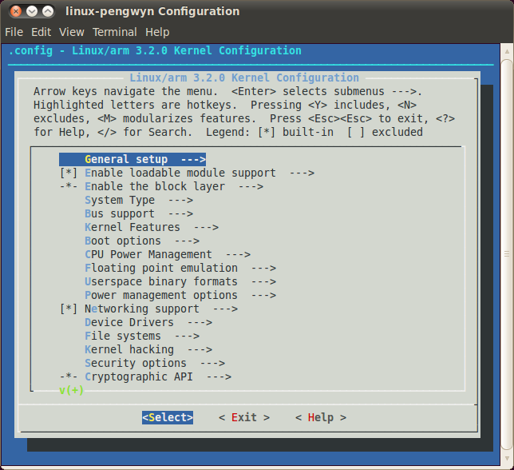

.. _kernel_page: 

How to customize the Linux Kernel
=================================

From menuconfig
---------------

The most frequent way of customization of the Linux Kernel is to change the .config file that contains the Kernel options. Setup the environment and run::

 pengwyn@pengwyn-desktop:~/yocto/build$ bitbake linux-pengwyn -c cleanall

 ...

 pengwyn@pengwyn-desktop:~/yocto/build$ bitbake linux-pengwyn -c menuconfig

 ...

a new window, like the following one, will pop-up

follow the instructions, save and exit, than you ready to generate your preferred image based on your customized kernel. If you prefer, you can build just the kernel running::

 pengwyn@pengwyn-desktop:~/yocto/build$ bitbake linux-pengwyn
 
 ...

At the end of the build process, the output file (uImage.bin), along with the built kernel modules (modules-3.2.0-r0-pengwyn.tgz), will be placed under *tmp/deploy/images/* inside your build directory, so, if you are building your system from the default directory, the destination directory will be */home/pengwyn/yocto/build/tmp/deploy/images*.

From sources
------------

If you want to modify the Linux kernel sources instead, insert the following commands to create an image of the actual used sources:

::

 pengwyn@pengwyn-desktop:~$ mkdir -p /home/pengwyn/Documents/linux-kernel
 pengwyn@pengwyn-desktop:~$ cd /home/pengwyn/Documents/linux-kernel
 pengwyn@pengwyn-desktop:~/Documents/linux-kernel$ cp /home/pengwyn/yocto/poky/meta-silica/recipes-kernel/linux/linux-pengwyn-3.2/linux-pengwyn* .
 pengwyn@pengwyn-desktop:~/Documents/linux-kernel$ tar -xzf linux-pengwyn_3.2.tar.gz
 pengwyn@pengwyn-desktop:~/Documents/linux-kernel$ mv linux-pengwyn_3.2 a
 pengwyn@pengwyn-desktop:~/Documents/linux-kernel$ patch -p1 -d a/ < linux-pengwyn_3.2.patch
 patching file ...
 ...
 pengwyn@pengwyn-desktop:~/Documents/linux-kernel$ cp -r a/ b/

Modify the sources contained inside directory **b**, than create your patch

::

 pengwyn@pengwyn-desktop:~/Documents/linux-kernel$ diff -Naur a/ b/ > linux-pengwyn_3.2.mine.patch
 pengwyn@pengwyn-desktop:~/Documents/linux-kernel$ cp linux-pengwyn_3.2.mine.patch /home/pengwyn/yocto/poky/meta-silica/recipes-kernel/linux/linux-pengwyn-3.2/

Create a file named *linux-pengwyn_3.2.bbappend* inside directory */home/pengwyn/yocto/poky/meta-silica/recipes-kernel/linux/* and write the following text inside the .bbappend file::

 SRC_URI += "file://linux-pengwyn_3.2.mine.patch \
 "

Clean and build:

::

 bitbake linux-pengwyn -c cleanall
 bitbake linux-pengwyn

Building kernel without bitbake
-------------------------------

The following commands are used to build the kernel without bitbake. First of all, install the package uboot-mkimage:

::

 apt-get install uboot-mkimage

and setup the environment:

::

 export PATH="$PATH:/opt/poky/1.2.1/sysroots/i686-pokysdk-linux/usr/bin/armv5te-poky-linux-gnueabi"

After that, in linux kernel folder, set the kernel options:

::

 make ARCH=arm CROSS_COMPILE=arm-poky-linux-gnueabi- menuconfig

and build the kernel:

::

 make ARCH=arm CROSS_COMPILE=arm-poky-linux-gnueabi- uImage

It is not necessary using *make clean* to rebuild the kernel image after have modified source code.

.. note::

 Use option -j with make to speed up the compilation

 -j [jobs], --jobs[=jobs]
            Specifies  the number of jobs (commands) to run simultaneously.  If there is more than one -j option, the last one is effective.  If the -j option is given without
            an argument, make will not limit the number of jobs that can run simultaneously.

 example: make -j 4 ARCH=arm CROSS_COMPILE=arm-poky-linux-gnueabi- uImage
