.. _quick:

Quick start guide
=================

This document will guide you from importing the virtual machine to the debugging of an Hello World! example on a customized Linux distribution that you will generate with the Yocto toolchain.

Installing the Virtual Machine
------------------------------

The development environment is provided as a Virtual Machine image. 

To be able to use it, you first need to install VirtualBox. The version must be 4.2.10 or above. 

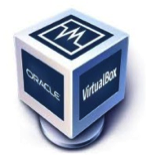

Go to:

https://www.virtualbox.org/wiki/Downloads

and download the version that suits your host operating system. You need to download and install the Extension Pack as well.

.. important::
   Make sure that the extension pack has the same version of VirtualBox.

Install the software with all the default options.

Run VirtualBox and follow these steps: 

.. tip::
   If you are using Linux double click directly on the .ova file from your file explorer and jump to step 3.

1. From the menu: *File → Import Appliance*

.. image:: /_static/importAppliance.png

2. Click on “Open appliance…” button and select the .ova file “PengwynYocto-beta-2013-03-19.ova”.

3. After opening the appliance, click on “Shared Folders” and select a folder to share with your host operating system.

.. image:: /_static/vbSharedFolders.png

4. The ethernet card must be attached to the LAN, not to the WLAN (within this guide you will be asked to connect the Pengwyn board to the PC with an ethernet point-to-point connection). To set the correct card, go to menu "machine -> Settings".
   Click on "Network" tab and select your LAN card. Double check also that the field "Attached to" is set to "Bridged Adapter".
   If you want to improve the performances of the virtual machine, please read :ref:`cpuRam2`.
   Click on button "Ok" to apply your choices when you are done.

.. image:: /_static/ivs2.png

5. Click the icon "Start" button on the toolbar.

.. image:: /_static/vbStart.png

How to configure the network on the virtual machine
---------------------------------------------------

Another important thing to do is to set the IP address of the virtual machine as static. To do this follow the next steps inside the virtual machine:

1. Right-click on network connection icon. Select *Edit Connections...*.

.. image:: /_static/ip-1.png

2. In *Wired" tab, select "Auto eth0" and press *Edit...* button.

.. image:: /_static/auto-eth0.png

3. Click to *IPv4 Settings*, press on *Add* button and insert the following address:

* *Address*: 192.168.0.20

* *Netmask*: 255.255.255.0

* *Gateway*: none

.. image:: /_static/edit-connection.png

4. Click on Apply.

.. _cpuRam2:

How to setup the number of CPUs and the amount of RAM used by your virtual machine
----------------------------------------------------------------------------------

You can configure the system settings of the virtual machine. This is possible only if the virtual machine is off. First, select the Yocto based SDK virtual machine from the list of virtual machines, click on the  *Settings* icon in the *Oracle VM VirtualBox Manager* window:

.. image:: /_static/setvm-1.png

In the left menu, click on *System*. In the *Motherboard* tab you can select how much **RAM** you want to assign to the vm.

.. image:: /_static/setvm-2.png

Select *Processor* tab to select how many **CPUs** you want to assign to the virtual machine:

.. image:: /_static/setvm-3.png

If you changed the number of processors, you might want to consider reading the guides on how to speedup the build process for :ref:`Poky <pokySpeedup>` and :ref:`HOB <hobSpeedup>`.

The welcome screen
------------------

The first time you boot the virtual machine you are asked to accept the licence agreement, than you can use the GUI of the welcome screen to easily access to toolchain and documentation.

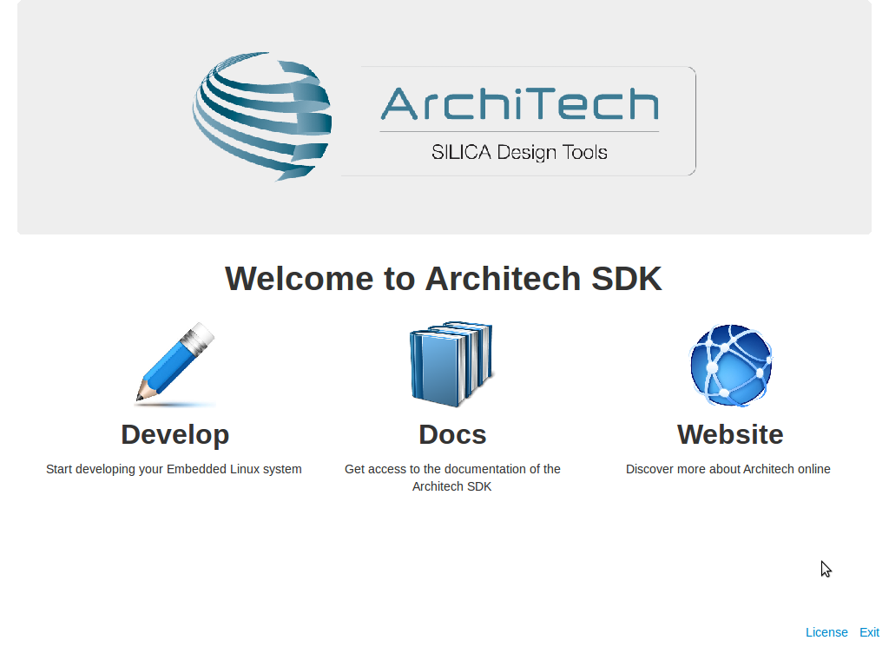

If you close this application you can relaunch it with the icon on the desktop

The first screen is composed of three icons, if you click on **Docs** you will be redirected to the documentation page while **WebSite** will show you a web page where you can find more information about hardware and software tools of ArchiTech.
Clicking on **Develop** will open a second screen also composed of three icons.

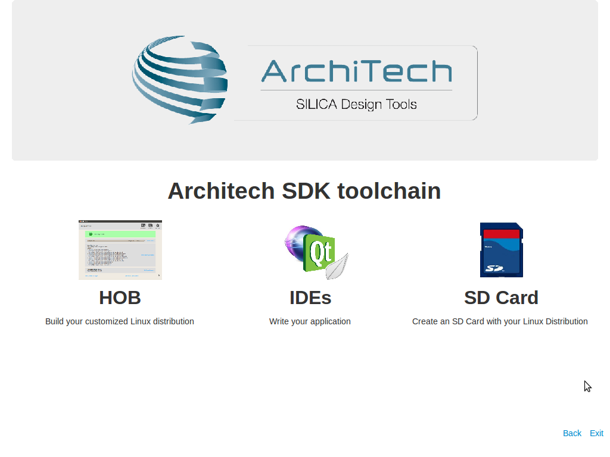

From that screen, you can:

* start HOB (the graphic interface for bitbake) to customize and build your preferred Linux distribution,
* select your preferred editor to write your application, that means the **Eclipse IDE** or **Qt Creator**, 
* start the scripts to create an SD card with your customized Linux distribution

By clicking **IDEs** you will be brought to the last screen where you can finally choose between Eclipse or Qt Creator.

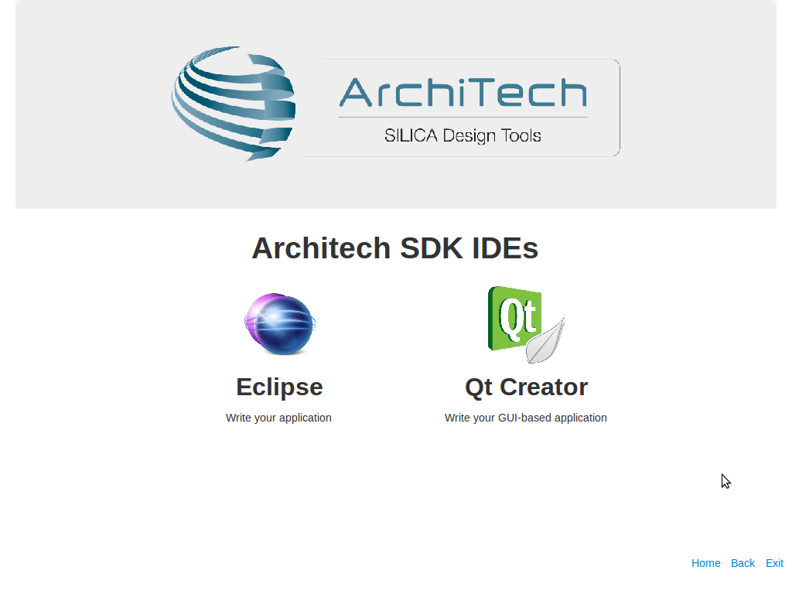

Let's build the system
----------------------

First of all you need to build a system, in this section you will build a predefined Linux image.

Click on HOB icon and wait until the GUI will show.

.. important::
	To run HOB you need a working Internet connection.
	If internet connection doesn't work you have to follow this instructions:

	1. Click with the right button of the mouse on the ethernet icon on the top right of the screen

	2. Select **Edit Connections...**

	.. image:: _static/ip-1.png

	3. In the wired tab select "wired connection" and press **Edit** button

	4. With another PC go to this web page: **http://www.opendns.com/opendns-ip-addresses** and copy the two IPs

	5. Go in the **IPv4 Settings** tab and write in **DNS Servers** text box the two IPs that you have copied

	If required the sudo password is **pengwyn**

Select **pengwyn** as current machine from the drop-down menu.

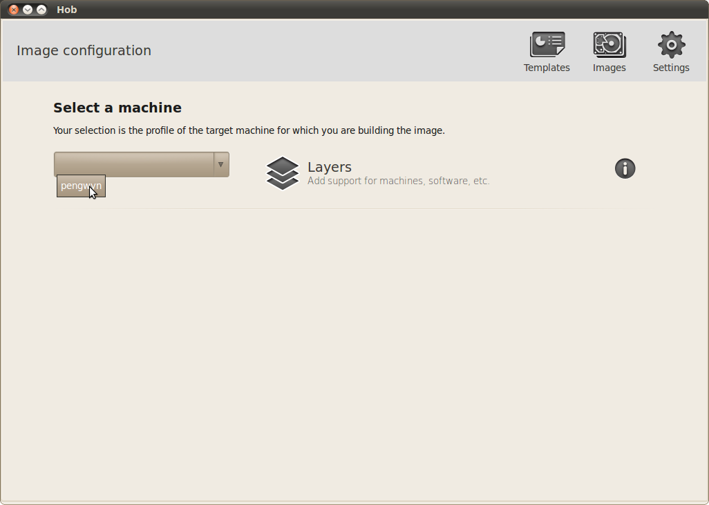

Select **core-image-minimal-dev** as base image.

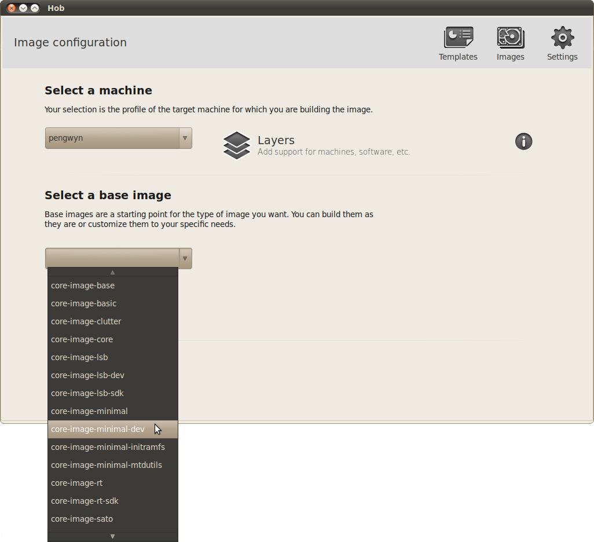

Click on **Build image** button.

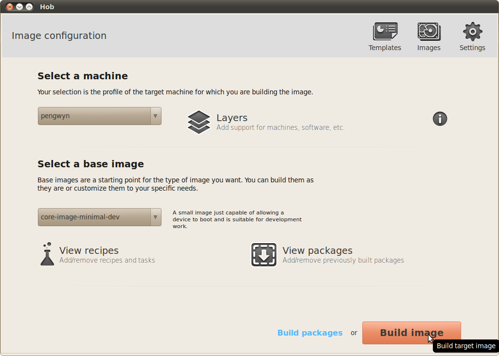

.. important::
	The build process can last hours.

Wait until it finishes.

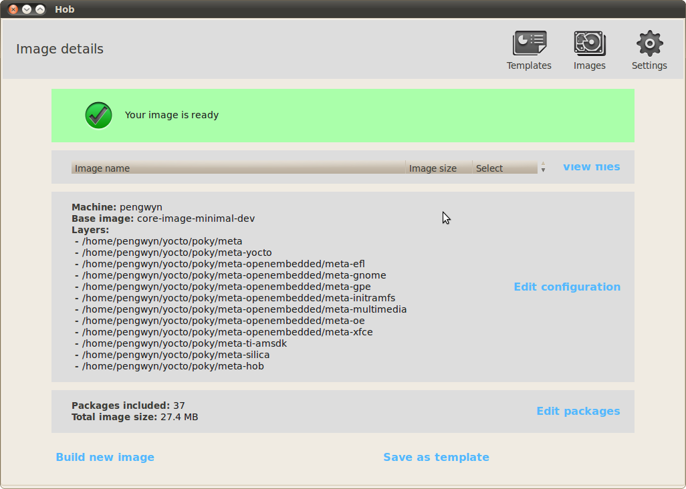

At the end of the build the images will be automatically saved in */home/pengwyn/yocto/build/tmp/deploy/images* folder.

Create your SD card
-------------------

.. important::
	You must have an SD card reader/programmer to build the SD card.
	The SD card must be at the least 1GB size.
	VirtualBox will see only USB connected SD card reader/programmer. This guide will assume you have a USB device for such a purpose.

To create your SD card, please follow these steps:

* Connect your SD card reader to your computer than to the virtual machine, from VirtualBox menu select Devices → USB Devices → "your SDcard reader".
* Insert the SD card into the adapter (in this example we are inserting an SD card already partitioned with a FAT and an EXT2 partition, that is the basic configuration for the Pengwyn board).
* Run the following command

::

 pengwyn@pengwyn-desktop:~$ sudo fdisk -l

 Disk /dev/sdb: 1971 MB, 1971322880 bytes
 255 heads, 63 sectors/track, 239 cylinders
 Units = cylinders of 16065 * 512 = 8225280 bytes
 Sector size (logical/physical): 512 bytes / 512 bytes
 I/O size (minimum/optimal): 512 bytes / 512 bytes
 Disk identifier: 0x9bfa2153
 
    Device Boot      Start         End      Blocks   Id  System
 /dev/sdb1   *           1           9       72261    c  W95 FAT32 (LBA)
 /dev/sdb2              11         239     1839442+  83  Linux

* Find the device name from fdisk command output, in this example is **/dev/sdb**.

* Run the script that will prepare the SD card with all the needed files by clicking on the :index:`splash screen` sd card icon, after having clicked the develop icon.

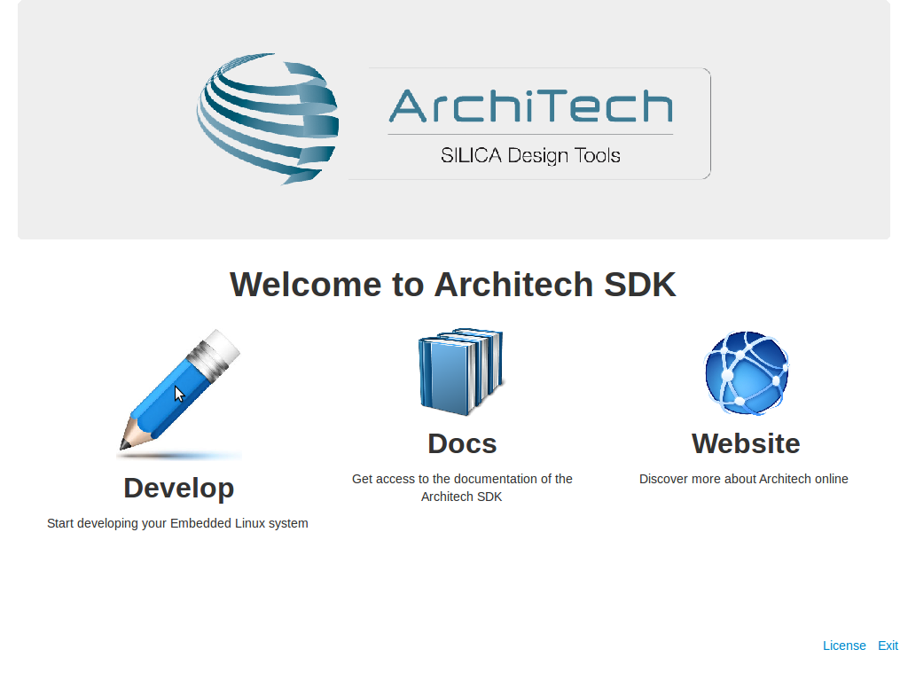

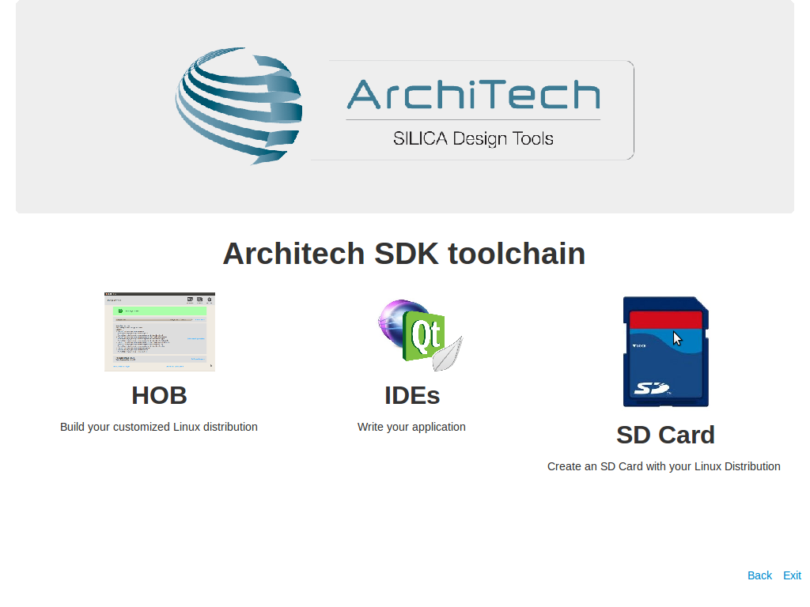
  
| When the script starts asks for the :index:`sudo password`, type **pengwyn** followed by enter-key.
| The list of available devices will be shown: the SD card should be the number **1** of the list with name sdb. Check the size shown on the table to be sure that the device is the correct one. Enter the device number **1** followed by enter-key.

::

 +------------------------------------------------------------------------------+
 |                                                                              |
 | This script will create a bootable SD card.                                  |
 | The script must be run with root permissions.                                |
 |                                                                              |
 +------------------------------------------------------------------------------+

 +------------------------------------------------------------------------------+
 | LIST OF AVAILABLE DRIVES:                                                    |
 +------------------------------------------------------------------------------+

 #  major   minor    size   name 
 1:   8       16    1927168 sdb
 
 Enter Device Number #:

| The script will create two partitions on the SD card: the first one is a **FAT32** with the **boot files**, the second one is an **ext3** with the **target file system**.
| The operations will take few minutes.

::

 [sudo] password for pengwyn: 

 +------------------------------------------------------------------------------+
 |                                                                              |
 | This script will create a bootable SD card.                                  |
 | The script must be run with root permissions.                                |
 |                                                                              |
 +------------------------------------------------------------------------------+

 +------------------------------------------------------------------------------+
 | LIST OF AVAILABLE DRIVES:                                                    |
 +------------------------------------------------------------------------------+

 #  major   minor    size   name 
 1:   8       16    1927168 sdb
 
 Enter Device Number #: 1
 
 sdb was selected

 sdb1  sdb2
 72261 1839442

 Mount the partitions 
 Emptying partitions 
 Syncing....

 +------------------------------------------------------------------------------+
 |	Copying files now... will take minutes				       |
 +------------------------------------------------------------------------------+

 Copying boot partition
 Copying file system partition
 Copying modules                                                            
 Syncing....                                                                
 Un-mount the partitions 
 Remove created temp directories 
 Operation Finished
 
 Press ENTER to finish

* Remove the SDcard

Run your first Application on Pengwyn board!
--------------------------------------------

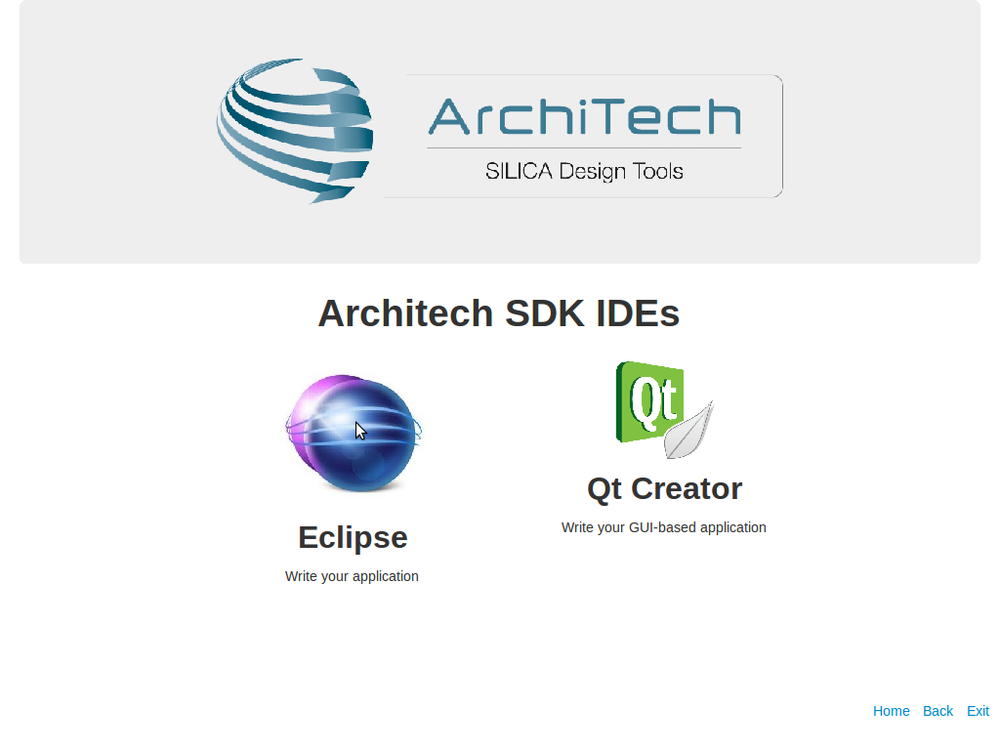

From the splash screen select Develop->IDEs and open Eclipse. Once the IDE is started, the project **HelloWorld** is opened by default. To build it click  *Project→Build All*.
To debug the application connect your Host PC to Pengwyn Board with an Ethernet cable. Connect the Pengwyn board to the PC by means of a usb cable to power the board and to have the serial console

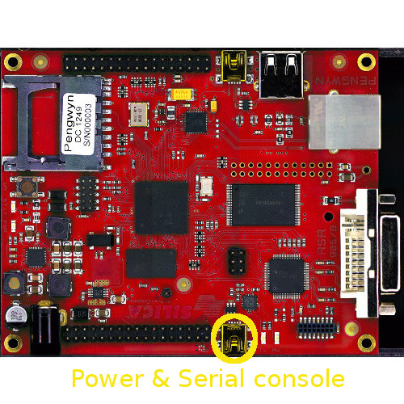

On your Host Operating System open a terminal console (ctrl+alt+t) and run command:

::

 minicom -w -s

choose *select port setup* and press **Enter**. Setup the port with the following configuration:

::

 A -    Serial Device      : /dev/ttyUSB0
 B - Lockfile Location     : /var/lock
 C -   Callin Program      :
 D -  Callout Program      :
 E -    Bps/Par/Bits       : 115200 8N1
 F - Hardware Flow Control : No
 G - Software Flow Control : No

once you are done configuring the serial port, you are back to minicom main menu and you can select **exit**.
press the **reset button** on the Pengwyn board.
The login will appear inside the terminal of the Pengwyn board:

::

 Yocto (Built by Poky 7.0.1) 1.2.1
 ttyO0

 pengwyn login:

.. note::

  sometimes you need press enter to view the login

Insert **root** and press **enter**. run command:

::

  ifconfig eth0 192.168.0.101
  ping 192.168.0.20

If the output is similar to this one:

::

 64 bytes from 192.168.0.20: icmp_req=1 ttl=64 time=0.946 ms                     
 64 bytes from 192.168.0.20: icmp_req=2 ttl=64 time=0.763 ms                     
 64 bytes from 192.168.0.20: icmp_req=3 ttl=64 time=0.671 ms                     
 64 bytes from 192.168.0.20: icmp_req=4 ttl=64 time=0.793 ms

the ethernet connection is ok, then run command:

::

  /etc/init.d/tcf-agent restart

| Now the target is ready to debug your application.
| Return in the virtual machine with eclipse. Go to *Run→Debug Configurations*.
| Enter the absolute path into which you want to deploy the application. Use the *Browse* button near *Remote Absolute File Path for C/C++Application:* field. No password is needed.

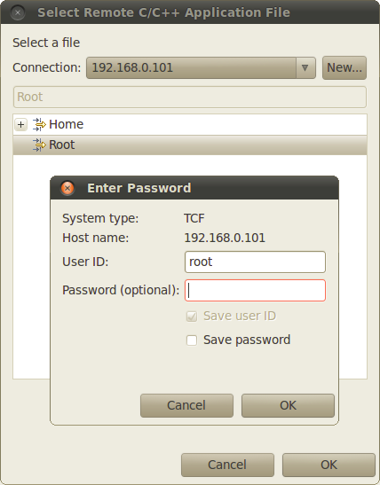

Enter also in the path the name of the application you want to build. (e.g. HelloWorld)

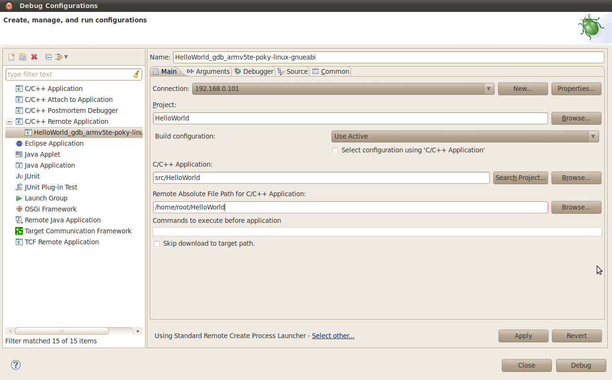

| Click *Debug* to bring up a login screen and login as root.
| Accept the debug perspective. 

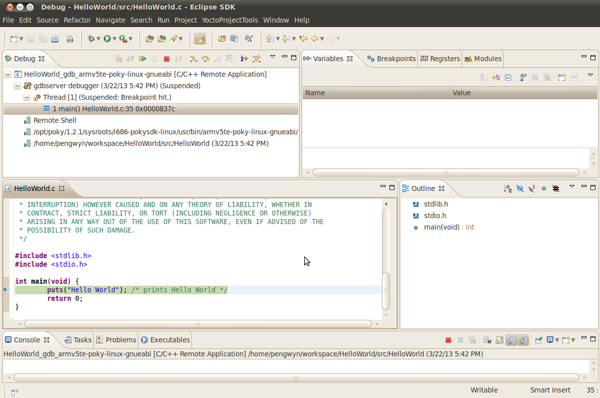

With **F6** key you can execute the application **step by step**. You can see the target output in the eclipse *console view*

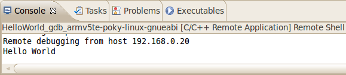

