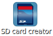

.. _sdcard: 

How to create the SD card
=========================

This section describes the steps to be followed to create a standalone bootable system on **SD card**. 

Prerequisites
-------------
Ensure that the following is available:

* An SD memory card reader/programmer to copy files from the Linux Host. The SD card reader must be accessible from VirtualBox.

.. warning::

 **Not all computer built-in readers can be used, use USB connected devices instead.**

* An SD card

.. warning::

 **Your sd-card will be formatted and all the data contained in it will be lost forever!**

* A Linux host with fdisk, sfdisk, mkfs.ext3 and mkfs.vfat utilities. If you are running the VM with Ubuntu pre-installed and the environment already in place, all the packages are already available.

* The files :index:`MLO`, :index:`u-boot-pengwyn.img`, :index:`uImage.bin`, (optionally) the kernel modules (:index:`modules`-3.2.0-rX-pengwyn.tgz, where X is the revision number for the kernel modules, without any modification to the kernel configuration it should be 0) and the :index:`root file system` with name ending with **-pengwyn.tar.gz** are available inside the images deploy directory (*<build directory>/tmp/deploy/images/*, if your build directory is the default one, then the :index:`deploy directory` is */home/pengwyn/yocto/build/tmp/deploy/images*). The scripts will get the latest files from folder */home/pengwyn/yocto/build/tmp/deploy/images*. If you want to specify a custom directory enter the path directly after the script name, e.g.:

::

 run_sdcard /home/pengwyn/custom-dir

Otherwise you can run it with **run_sdcard** command or use the icon on desktop:

.. index:: SD
.. index:: card

How to build the SD card
------------------------

* Run the VM on VirtualBox

* Connect your SD card reader to your computer than to the virtual machine, from VirtualBox menu select Devices → USB Devices → "your SDcard reader".
* Insert the SD card into the adapter (in this example we are inserting an SD card already partitioned with a FAT and an EXT2 partition, that is the basic configuration for the Pengwyn board).
* Run the following command

::

 pengwyn@pengwyn-desktop:~$ sudo fdisk -l

 Disk /dev/sdb: 1971 MB, 1971322880 bytes
 255 heads, 63 sectors/track, 239 cylinders
 Units = cylinders of 16065 * 512 = 8225280 bytes
 Sector size (logical/physical): 512 bytes / 512 bytes
 I/O size (minimum/optimal): 512 bytes / 512 bytes
 Disk identifier: 0x9bfa2153
 
    Device Boot      Start         End      Blocks   Id  System
 /dev/sdb1   *           1           9       72261    c  W95 FAT32 (LBA)
 /dev/sdb2              11         239     1839442+  83  Linux

* Find the device name from fdisk command output, in this example is **/dev/sdb**.

* Run the script that will prepare the SD card with all the needed files to run the system, you can either:

1 ) double click on desktop icon:

2 ) execute the following script:

::

 run_sdcard

3 ) click on the :index:`splash screen` sd card icon, after having clicked the develop icon.

.. image:: _static/developSelection.png

.. image:: _static/sdCardSelection.png
  
| When the script starts asks for the :index:`sudo password`, type **pengwyn** followed by enter-key.
| The list of available devices will be shown: the SD card should be the number **1** of the list with name sdb. Check the size shown on the table to be sure that the device is the correct one. Enter the device number **1** followed by enter-key.

::

 +------------------------------------------------------------------------------+
 |                                                                              |
 | This script will create a bootable SD card.                                  |
 | The script must be run with root permissions.                                |
 |                                                                              |
 +------------------------------------------------------------------------------+

 +------------------------------------------------------------------------------+
 | LIST OF AVAILABLE DRIVES:                                                    |
 +------------------------------------------------------------------------------+

 #  major   minor    size   name 
 1:   8       16    1927168 sdb
 
 Enter Device Number #:

| The script will create two partitions on the SD card: the first one is a **FAT32** with the **boot files** (:index:`MLO`, :index:`u-boot-pengwyn.img`, :index:`uImage.bin` will be renamed to **MLO**, **u-boot.img** and **uImage**), the second one is an **ext3** with the **target file system**.
| The operations will take few minutes.

::

 [sudo] password for pengwyn: 

 +------------------------------------------------------------------------------+
 |                                                                              |
 | This script will create a bootable SD card.                                  |
 | The script must be run with root permissions.                                |
 |                                                                              |
 +------------------------------------------------------------------------------+

 +------------------------------------------------------------------------------+
 | LIST OF AVAILABLE DRIVES:                                                    |
 +------------------------------------------------------------------------------+

 #  major   minor    size   name 
 1:   8       16    1927168 sdb
 
 Enter Device Number #: 1
 
 sdb was selected

 sdb1  sdb2
 72261 1839442

 Mount the partitions 
 Emptying partitions 
 Syncing....

 +------------------------------------------------------------------------------+
 |	Copying files now... will take minutes				       |
 +------------------------------------------------------------------------------+

 Copying boot partition
 Copying file system partition
 Copying modules                                                            
 Syncing....                                                                
 Un-mount the partitions 
 Remove created temp directories 
 Operation Finished
 
 Press ENTER to finish

* Remove the SD card
