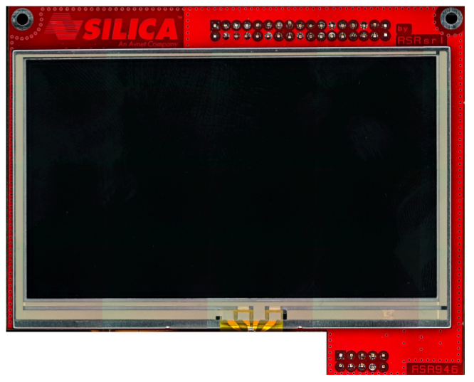
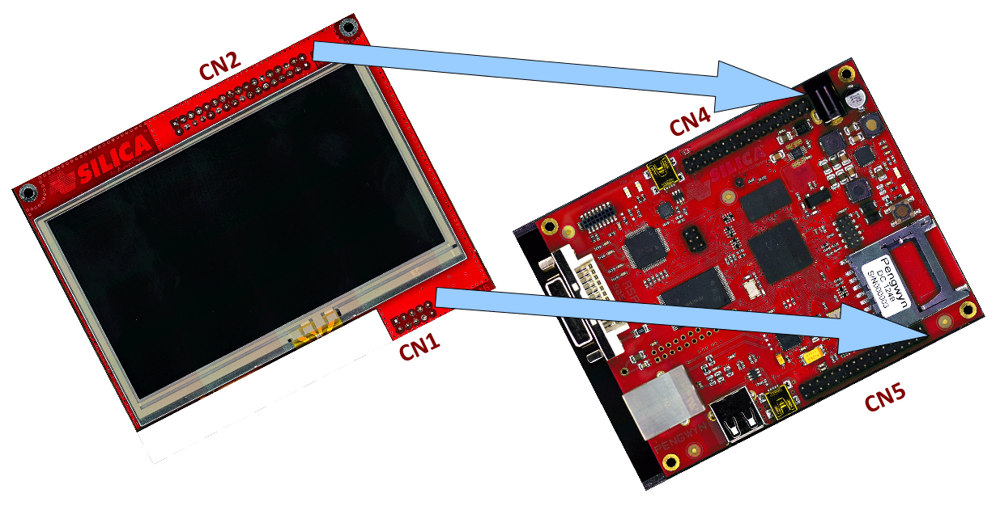
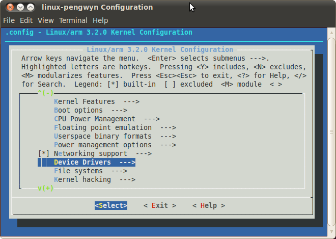
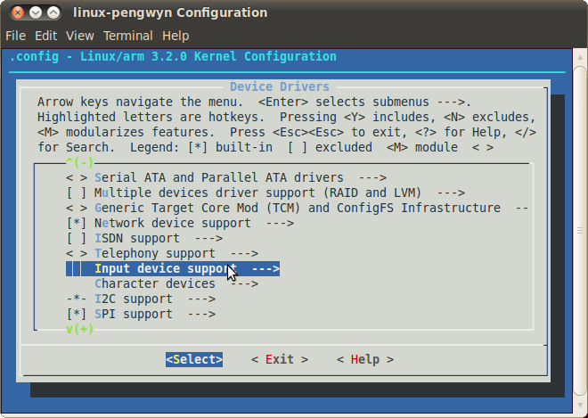
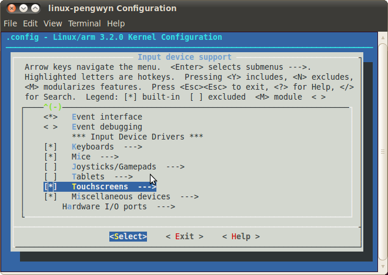
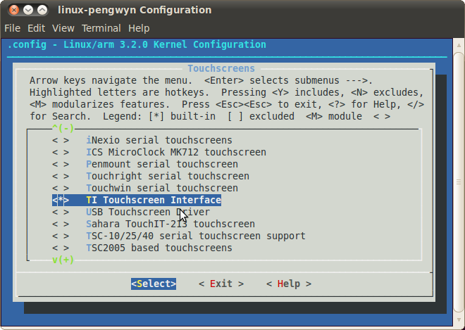

How to add 3"5 display with touch screen
========================================

This procedure will guide you to the installation of the display on the Pengwyn board and the configuration of the software to test it.

Installing the board
--------------------

1. switch off the board

2. connect display

3. switch on the board

Installing the software
-----------------------

1. run **VirtualBox** and start Pengwyn Yocto virtual machine

2. download the display patch (ref. `linux-pengwyn_3.2.display.patch.tar.gz <http://www.architechboards.com/pengwyn/updates/linux-pengwyn_3.2.display.patch.tar.gz>`_ ) and save the file to **/home/pengwyn** folder

3. open terminal and decompress patch

::

	cd /home/pengwyn
	tar xvf linux-pengwyn_3.2.display.patch.tar.gz

4. change kernel configuration, adding **TI touch screen driver**

::

	cd yocto
	source poky/oe-init-build-env
	bitbake linux-pengwyn -c cleanall
	bitbake linux-pengwyn -c menuconfig

5. compile the kernel

::

	bitbake linux-pengwyn

6. run **HOB**

7. select **Pengwyn** target and **qt4demo**

8. build 

9. run **SD card creator**

10. insert SDcard on Pengwyn board and wait Linux start-up

11. first time, **the touch screen calibration is needed**, than qt4 demo will start

